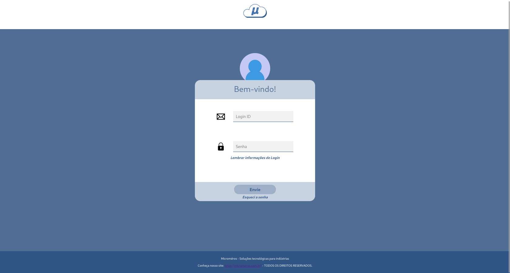
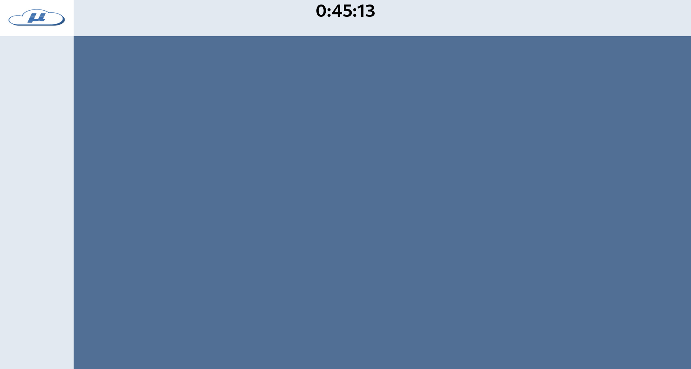

# Próximos passos no desenvolvimento do sistema
Após o levantamento de requisitos, entrevistas com cliente e avaliação do que já foi elaborado até o presente momento, é necessário criar os protótipos de telas que servirão como base para o desenvolvimento do código que implementará o sistema de chamados. Nesse sentido, com base nos casos de uso, os protótipos devem buscar levar uma experiência agradável e funcional ao usuário permitindo que se sinta confortável durante o uso. Os protótipos elaborados buscaram utilizar tons de azul, cor que a empresa utiliza e também telas simples, porém funcionais, entregando o que o cliente deseja e o que usuário se sentiria bem usando. 

Para o desenvolvimento das interfaces, o _front-end_, é necessário o início da implementação do código tendo levado tudo que foi citado em consideração. Para o código, utiliza-se o _framework_  ReactJS, permitindo criação de páginas SPA de forma mais intuitiva que o JavaScript puro. No nosso grupo, buscamos iniciar com a implementação da tela de _login_, com campos simples e que cumprem o requisitado: a entrada por ID (_e-mail_ corporativo) e senha, podendo redefinir, caso tenha esquecido. __Ademais, idealmente, cada integrante do grupo deve contribuir com a montagem de alguma página para que no fim o resultado seja alcançado com sucesso, caso contrário, o grupo encontrará dificuldades e sofrerá com quem não se empenhou como deveria.__

Tela de _login_: Rafael Lima

Componentes (_header_ e _side bar_ ) - telas dos usuários: Rafael Lima

Botão do usuário - telas dos usuários: Rafael Lima

